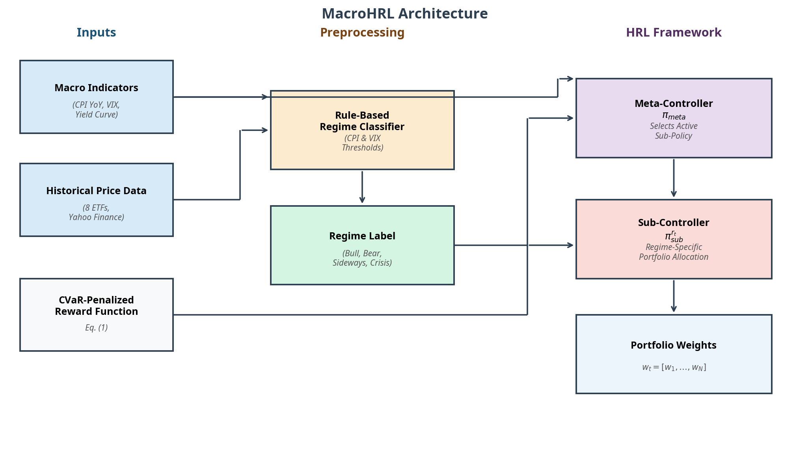
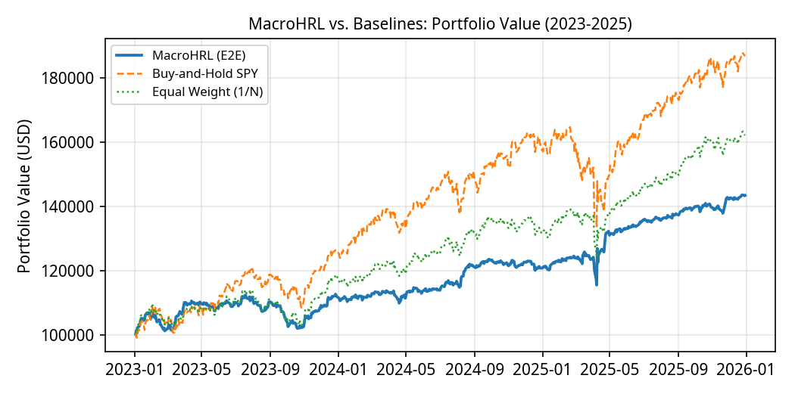
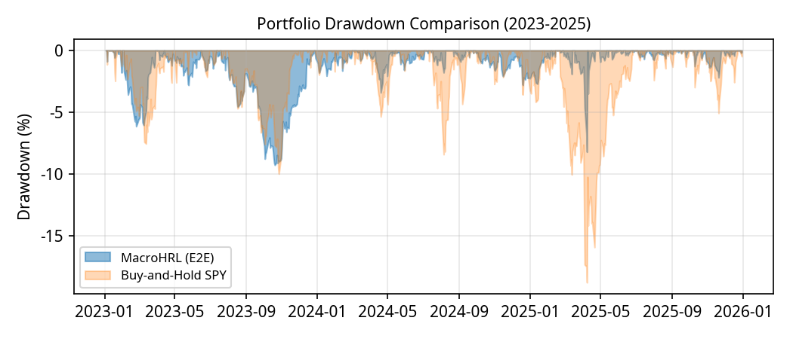

# MacroHRL  
## A Hierarchical Reinforcement Learning Framework for Risk-Aware Portfolio Management with Drawdown Minimization

**Authors:**  
Neelesh Nayak, Peter Lian  
University of Waterloo  

---

##  Overview

**MacroHRL** is a hierarchical reinforcement learning framework designed for **risk-aware portfolio management**. Unlike traditional portfolio optimization methods that focus solely on maximizing returns, MacroHRL prioritizes:

- 📉 Drawdown minimization  
- 🛡️ Capital preservation  
- 🔄 Regime-adaptive allocation  
- ⚠️ Tail-risk suppression  

The system uses a **two-level hierarchical architecture**:

- A **Meta-Controller** selects macroeconomic regimes quarterly  
- Specialized **Sub-Controllers** manage daily portfolio allocation  

---

##  System Architecture

Below is the MacroHRL framework pipeline:



The system consists of:

- **Macro Inputs:** CPI, VIX, Yield Curve  
- **Regime Classifier:** Rule-based macro regime detection  
- **Meta-Controller:** Quarterly regime selection  
- **Sub-Controllers:** Daily portfolio allocation agents  

---

## 🎯 Key Contributions

### 1️⃣ Hierarchical Reinforcement Learning for Finance

Portfolio management is formulated as a **Hierarchical Markov Decision Process (HMDP)**:

- Long-term macro decision making  
- Short-term tactical asset allocation  

---

### 2️⃣ Regime Specialization

Markets are classified into four regimes:

- 🟢 Bull  
- 🔴 Bear  
- ⚠️ Crisis  
- ➖ Sideways  

Each regime has a dedicated PPO trading agent trained exclusively on historical data from that environment.

---

### 3️⃣ Risk-Aware Reward Function

The Sub-Controllers optimize a CVaR-penalized reward to directly suppress tail risk and minimize drawdowns.

---

## 📈 Dataset

### Assets (Daily Data)

- SPY, QQQ, EFA, EEM  
- TLT, HYG, GLD, VNQ  

### Macroeconomic Indicators

- VIX (volatility)  
- CPI (inflation)  
- Yield Curve  

### Time Period

- **Training:** 2010–2022  
- **Testing:** 2023–2025  

---

## 📊 Results

### Portfolio Performance

MacroHRL produces a significantly smoother equity curve:



---

### Drawdown Comparison

MacroHRL’s key advantage is consistent downside protection:



---

## 📊 Performance Metrics (Out-of-Sample 2023–2025)

| Strategy | Sharpe | Annual Return | Max Drawdown | Calmar |
|-----------|--------|---------------|--------------|--------|
| **MacroHRL** | **1.369** | **13.42%** | **-9.26%** | **1.448** |
| Buy & Hold SPY | 1.616 | 24.80% | -18.76% | 1.322 |

---

## 🚨 Key Insight

MacroHRL achieves:

> **51% reduction in maximum drawdown** compared to SPY

This demonstrates strong risk-adjusted performance and superior capital preservation.

---

## 🧩 Why MacroHRL Matters

Traditional strategies struggle during:

- Market regime transitions  
- Black swan events  
- Correlation breakdowns  

MacroHRL solves this by:

- Separating macro strategy from tactical execution  
- Learning specialized regime policies  
- Explicitly optimizing downside risk  

---

## 🚀 Future Work

- Additional macroeconomic signals  
- Multi-agent coordination  
- LLM-enhanced macro reasoning  
- Real-time deployment pipelines  

---

## 📚 Citation

```
Nayak, N., & Lian, P. (2026).
MacroHRL: A Hierarchical Reinforcement Learning Framework for Risk-Aware Portfolio Management with Drawdown Minimization.
University of Waterloo.
```

---

## 📬 Contact
 
**Neelesh Nayak**  
University of Waterloo  
n4nayak@uwaterloo.ca  

**Peter Lian**  
University of Waterloo  
plian@uwaterloo.ca 

**Tony Xia**
University of Waterloo
t48xia@uwaterloo.ca

---

## ⭐ Quick Summary

MacroHRL = **Hierarchical RL + Regime Awareness + CVaR Risk Control**

Result: Dramatically lower drawdowns with strong risk-adjusted returns.
